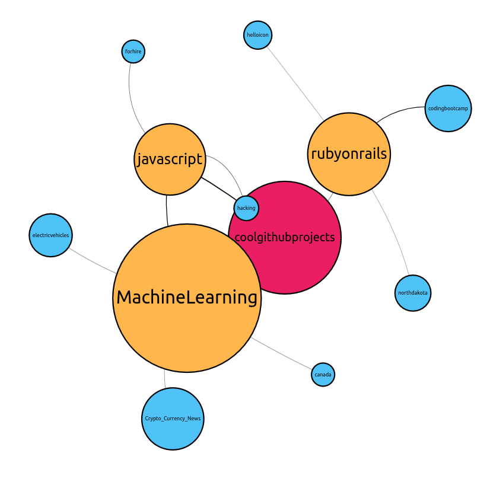

# Reddit Network Visualization

### Explore the interconnected world of Reddit communities through an interactive network graph.

This project visualizes subreddits based on shared active users, helping you uncover how different communities relate to each other. Each node represents a subreddit, and edges represent the strength of user overlap between them. You can start from any subreddit and recursively expand to see the most connected neighbors, making it useful for discovering clusters, niche communities, and hidden links across Reddit.

**Try it live here:** [redditnetwork.netlify.app](https://redditnetwork.netlify.app/)

Crafted using open source data. **Click here to find how we fetched the data:** [https://github.com/RVNayan/RedditNetwork](https://github.com/RVNayan/RedditNetwork)